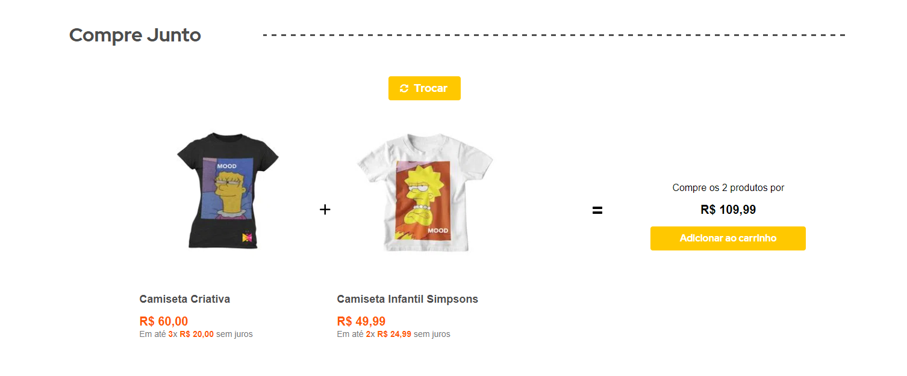

<h1 align="center">
    Controll Suggestions Block 🐝
</h1>

#
## 📝 Sobre o Projeto

- Aplicação para exibição das Sugestões Ativas pelo Admin da Bee In Controll Store.
- O bloco customizado foi inspirado no bloco Buy Together da VTEX, que faz o uso da Product Summary e do Add To Cart Button.


#
## 📸 Preview



#
## 🔨 Utilizando no Projeto

**1. Adicione `controll.product-suggestion-block` nas dependências do seu tema no `manifest.json`:**

```json
  "dependencies": {
    "controll.product-suggestion-block": "0.x"
  }
```
Agora, você pode usar todos os blocos exportados pelo aplicativo. Confira a lista abaixo:

| Bloco     | Descrição | 
| -------------- | ----------- | 
| [`buy-together-suggestions`] | Renderiza o Bloco de Compre Junto obtendo as Sugestões Ativas pelo Admin na API Controll Suggestions | 
| [`buy-together-custom`] | Customização do Bloco Buy Together VTEX para uso dos dados da API e permitir customização conforme necessidade do projeto | 

**2. Adicione o bloco `buy-together-suggestions` ao seu template e declare o `buy-together-custom` na sua lista de blocos. Também é possível adicionar um cabeçalho ao bloco de Sugestões através do `children`. Por exemplo:**

```json
{
  "buy-together-suggestions": {
    "blocks": ["buy-together-custom"],
    "children": ["flex-layout.row#section-title-buy-together"]
  },
```

**3. Também é possível customizar o bloco `product-summary` e `add-to-cart-button`, conforme exemplo:**

```json
{
  "buy-together-custom": {
    "blocks": ["product-summary.shelf#buy-together"],
    "props": {
      "BuyButton": "add-to-cart-button#buy-together"
    }
  },
```

---
### 📌 **Customização**

Para aplicar customizações de CSS neste e em outros blocos, siga as instruções fornecidas [aqui](https://developers.vtex.com/vtex-developer-docs/docs/vtex-io-documentation-using-css-handles-for-store-customization)

| CSS Handles |
| ----------- | 
| `buyTogetherContainer` | 
| `buyTogetherContent` | 
| `buyTogetherSuggestion` | 
| `buyTogetherIconPlus` | 
| `buyTogetherIconEqual` |
| `suggestionContainer` |
| `changeSuggestionContainer` |
| `changeSuggestionButton` |

#
## 💪🏻 Desenvolvido por
- [Douglas Rodrigues](https://www.linkedin.com/in/douglas-rodrigues-pnz/)
